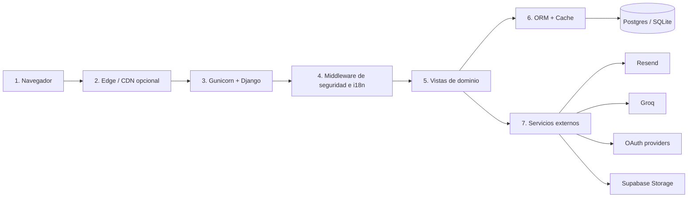
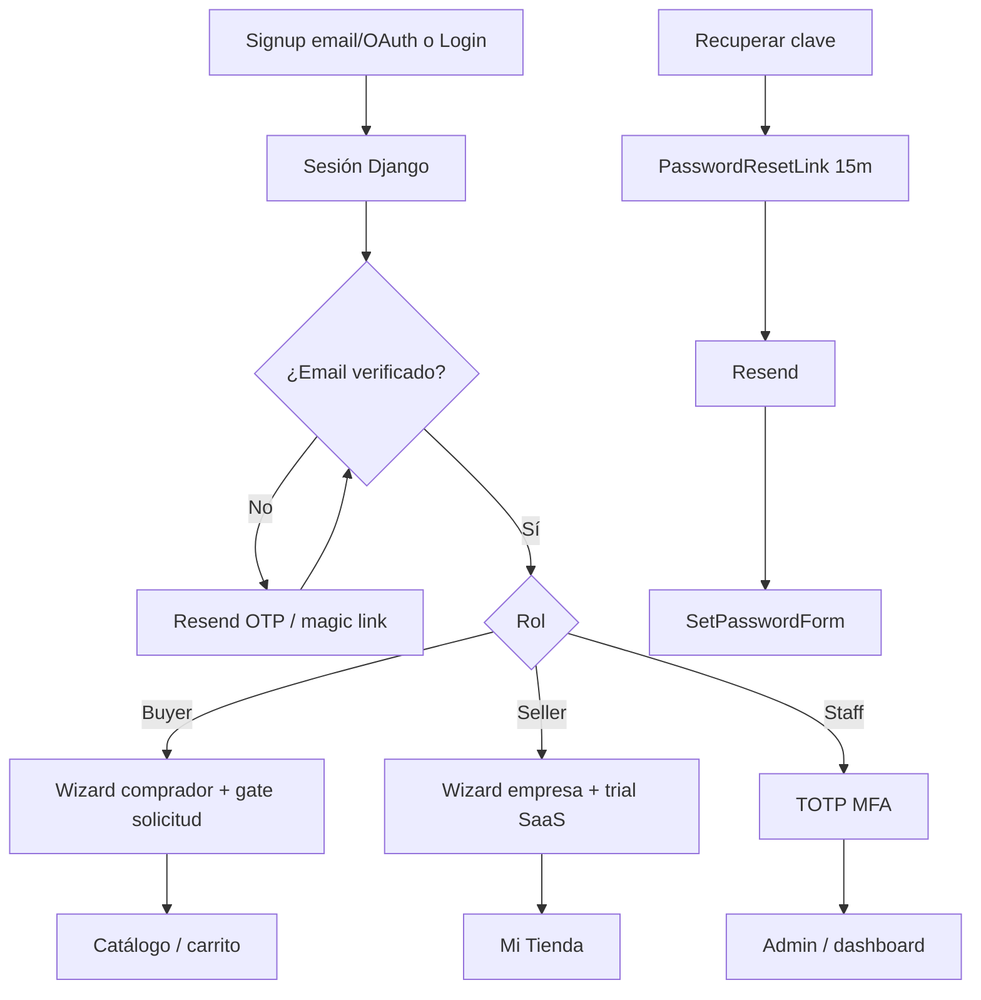
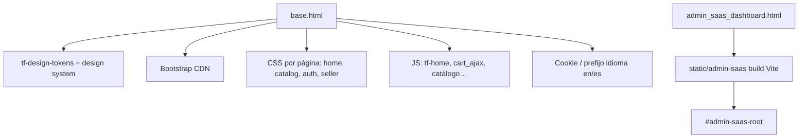
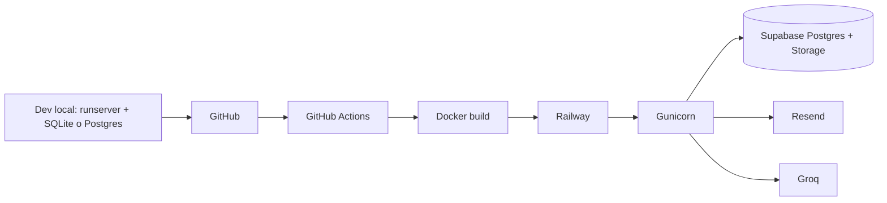

# Afiche técnico — TradeFlow Colón

**Marketplace B2B para la Zona Libre de Colón (Panamá)**  
**Última actualización:** julio 2026  
**Fuente de verdad:** código en producción del monorepo Django (`tradeflow_colon` + `core` + `analytics`)

Este documento describe **las tecnologías que el sitio usa hoy**, **qué función cumplen en la web** y **cómo se relacionan entre sí**. No incluye herramientas aspiracionales ni integraciones desactivadas (p. ej. Stripe SDK, Celery, Cloudinary).

---

## 1. Vista panorámica (1 página)

```mermaid
flowchart TB
  subgraph usuarios [Usuarios]
    Buyer[Comprador]
    Seller[Vendedor]
    Carrier[Transportista]
    Admin[Staff / Admin]
    Guest[Visitante público]
  end

  subgraph front [Capa de presentación]
    HTML[Plantillas Django HTML]
    CSSJS[static CSS/JS + Bootstrap CDN]
    React[Isla React Vite — panel /saas/]
    Leaflet[Leaflet / Folium — mapa ZLC]
  end

  subgraph app [Aplicación Django 6 + Gunicorn]
    Views[core.views + analytics]
    Merch[Merchandising / catálogo]
    AuthStack[Auth: Django + allauth + OTP + MFA staff]
    SaaS[Planes SaaS vendedor]
    Security[CSP · Axes · rate limit · GDPR utils]
  end

  subgraph datos [Datos y servicios]
    PG[(PostgreSQL — Supabase)]
    SQLite[(SQLite — solo local)]
    Cache[(Redis | DatabaseCache | LocMem)]
    Media[Media: disco o Supabase Storage S3]
    Resend[Resend — email transaccional]
    Groq[Groq LLM — asistente / analítica]
    OAuth[OAuth Google · Microsoft · LinkedIn]
  end

  subgraph deploy [Despliegue]
    Docker[Docker + Railway]
    WN[WhiteNoise estáticos]
    CF[Cloudflare purge opcional]
    CI[GitHub Actions CI]
  end

  Buyer --> HTML
  Seller --> HTML
  Carrier --> HTML
  Admin --> HTML
  Admin --> React
  Guest --> HTML
  HTML --> CSSJS
  HTML --> Leaflet
  HTML --> Views
  React --> Views
  Views --> Merch
  Views --> AuthStack
  Views --> SaaS
  Views --> Security
  Views --> PG
  Views --> Cache
  Views --> Media
  AuthStack --> Resend
  AuthStack --> OAuth
  Views --> Resend
  Views --> Groq
  Merch --> Cache
  Docker --> Views
  WN --> CSSJS
  CI --> Docker
  CF --> WN
```

**Idea central:** TradeFlow es un **monolito Django 6** renderizado en el servidor (MPA). El navegador recibe HTML + CSS/JS. Solo el panel admin SaaS (`/saas/`) monta una **isla React**. Postgres (Supabase), email (Resend), OAuth, cache e IA (Groq) son servicios satélite.

---

## 2. Inventario de tecnologías (qué es y para qué sirve)

### 2.1 Núcleo de la aplicación

| Tecnología | Rol en la página | Relación |
|---|---|---|
| **Python 3.12** | Runtime del servidor | Base de todo el backend |
| **Django 6.0.5** | Framework web: rutas, ORM, formularios, auth, admin | Orquesta plantillas, modelos y APIs JSON |
| **Gunicorn 23** | Servidor WSGI en producción | Expone Django detrás de Railway |
| **WhiteNoise** | Sirve CSS/JS/imágenes estáticas sin Nginx | Middleware + manifest en prod |
| **python-decouple** | Lee `.env` / variables de entorno | Configura secretos y feature flags |

### 2.2 Datos y persistencia

| Tecnología | Rol | Relación |
|---|---|---|
| **PostgreSQL** (vía `DATABASE_URL`, tip. Supabase) | Base de datos principal: usuarios, empresas, productos, órdenes, SaaS | Django ORM (`core/models.py`, `enterprise_models.py`) |
| **SQLite** | Fallback local sin `DATABASE_URL` | Mismo ORM, desarrollo |
| **psycopg2-binary** + **dj-database-url** | Driver y parseo de URL | Conectan Django ↔ Postgres |
| **Redis** (`REDIS_URL`, opcional) | Cache compartida (home, merchandising, hot paths) | Backend de `django.core.cache` |
| **DatabaseCache / LocMem** | Cache si no hay Redis | Misma API de cache |
| **Supabase Storage** + **django-storages** + **boto3** | Fotos de producto / media en bucket S3-compatible | Sustituye filesystem cuando hay `SUPABASE_*` |
| **Pillow** | Procesamiento de imágenes | Uploads y demos |

### 2.3 Autenticación, identidad y seguridad

| Tecnología | Rol en la web | Relación |
|---|---|---|
| **Django Auth** | Sesiones, login/logout, permisos | Base de todos los roles |
| **django-allauth** | OAuth **Google / Microsoft / LinkedIn** | `/accounts/*`, adapters en `core/social_auth.py` |
| **OTP + verificación email** | Códigos / magic links al registrarse y en checkout | `EmailVerification` + Resend |
| **PasswordResetLink** | Recuperar clave (TTL 15 min, single-use) | Formulario Django + email Resend |
| **django-axes** | Bloqueo tras intentos fallidos de login | Middleware + backend de auth |
| **Argon2** (`argon2-cffi`) | Hash de contraseñas | `PASSWORD_HASHERS` |
| **Staff TOTP MFA** | 2FA obligatorio para staff/admin (salvo demo Expo) | `STAFF_MFA_REQUIRED`, middleware + `core/utils/staff_mfa.py` |
| **CSP con nonce** | Content-Security-Policy por request | `SecurityHeadersMiddleware` + plantillas |
| **Rate limit API / CSRF / HSTS** | Endurecimiento OWASP | Middleware `tf_security`, settings prod |
| **Utilidades GDPR / privacy** | Consentimiento, borrado/hashes de secretos | `core/utils/privacy.py`, migraciones privacy |

### 2.4 Comunicación y documentos

| Tecnología | Rol | Relación |
|---|---|---|
| **Resend** | Emails reales: OTP, órdenes, reset, SaaS | `core/email_service.py` / `email_sender.py` |
| **reportlab** | PDFs: facturas, packing lists, RFQ | Generados en vistas seller/buyer |
| **qrcode** | QR de visitante ZLC / vendedor | Portales y pre-registro |

### 2.5 Inteligencia y analítica

| Tecnología | Rol | Relación |
|---|---|---|
| **Groq** (+ cliente **openai** compatible) | Asistente in-app (`/api/asistente/`), chat de analítica seller | `GROQ_API_KEY`, app `analytics/` |
| **pandas / numpy / plotly / XlsxWriter** | KPIs, gráficas, export Excel del seller | `/mi-tienda/analitica/` |
| **Chart.js** (vendor estático) | Gráficas en dashboards Django | Templates admin/seller |

### 2.6 Frontend (lo que ve el usuario)

| Tecnología | Rol | Relación |
|---|---|---|
| **Plantillas Django** (`templates/core/`) | HTML de marketplace, auth, portales | Render server-side |
| **Design system CSS** (`static/css/`) | Tokens, home, catálogo, auth, seller shell | Cargado desde `base.html` |
| **JS estático** (`static/js/`) | Home, carruseles, carrito AJAX, catálogo, mapas | Sin SPA global |
| **Bootstrap 5.3 (CDN)** | Componentes UI auxiliares | Layouts y formularios |
| **Fuentes** (Montserrat, DM Serif Display, Inter, Material Symbols) | Tipografía / iconos | `base.html` |
| **React 19 + Vite 8 + Tailwind 4** | Solo panel **Admin SaaS** en `/saas/` | Build → `static/admin-saas/` |
| **Folium + Leaflet** | Mapa interactivo ZLC (`/mapa/`) | Vista Django + CSP permisiva para tiles |

### 2.7 Infraestructura y calidad

| Tecnología | Rol | Relación |
|---|---|---|
| **Docker** | Imagen de producción (Python slim, collectstatic) | Entrypoint: migrate → gunicorn |
| **Railway** | Hosting + healthchecks `/health/live\|ready/` | `railway.json` |
| **Cloudflare** (opcional) | Purge de cache de estáticos en deploy | Script post-arranque |
| **GitHub Actions** | CI: tests, check, build admin-saas, audits | `.github/workflows/` |
| **i18n en / es** | Marketplace bilingüe | `i18n_patterns`, `locale/` |
| **Zona horaria** | `America/Panama` | Settings Django |

### 2.8 Qué **no** forma parte del stack activo

| Mencionado a veces | Estado real |
|---|---|
| **Stripe / PayPal SDK** | Enums/UI o mock; pagos plan = transferencia / mock DEBUG |
| **Celery / colas async** | No hay workers |
| **Cloudinary** | No integrado |
| **Nginx** | No; WhiteNoise cubre estáticos |
| **Django REST Framework** | No; JSON = vistas Django |
| **SPA React/Vue en marketplace** | No; MPA Django (React solo `/saas/`) |
| **Edge Function Gmail en Supabase** | Existe carpeta legacy; el correo de la app va por **Resend** |

---

## 3. Capas de la arquitectura (cómo se relacionan)



| Capa | Qué ocurre |
|---|---|
| **1. Navegador** | Usuario ve HTML; ejecuta JS de carrito/home; en `/saas/` monta React |
| **2. Edge** | Cloudflare puede cachear estáticos; purge al deploy |
| **3. App server** | Gunicorn ejecuta Django; WhiteNoise entrega CSS/JS |
| **4. Middleware** | Locale, CSRF, sesión, allauth, axes, onboarding gate, CSP, MFA staff, rate limit |
| **5. Dominio** | Catálogo, carrito, auth, seller, admin, analytics, merchandising |
| **6. Persistencia** | Modelos → Postgres; cache acelera home/catálogo |
| **7. Externos** | Email, IA, OAuth, media en la nube |

**Apps Django:**

- `tradeflow_colon/` — settings, URLconf raíz, WSGI/ASGI  
- `core/` — marketplace completo (modelos, vistas, auth, SaaS, logística)  
- `analytics/` — analítica IA del vendedor (`/mi-tienda/analitica/`)

---

## 4. Roles de negocio ↔ sistemas que usan

| Rol | Rutas típicas | Tecnologías que tocan |
|---|---|---|
| **Visitante** | `/`, `/catalogo/`, `/verified-suppliers/`, `/deals/`, `/mapa/` | Plantillas, merchandising, cache, Folium |
| **Comprador** | Signup/OTP → onboarding → carrito → checkout → órdenes / RFQ | Auth, Resend, sesión `carrito`, Order/Payment, PDF |
| **Vendedor** | `/mi-tienda/*`, planes SaaS, QR, insights, analítica | SaaS billing, media Storage, Groq/Plotly, reportlab |
| **Transportista** | Portal envíos / asignaciones | Modelos logística + email |
| **Staff/Admin** | `/dashboard/`, `/admin/`, `/saas/`, aprobaciones | Axes + **MFA TOTP**, Chart.js, isla React SaaS |

---

## 5. Flujos clave de la web (tecnologías en juego)

### 5.1 Auth y acceso



### 5.2 Compra B2B (carrito → orden)

1. Catálogo (`Product` / `Company`) + merchandising cacheado  
2. Carrito en **sesión Django** (`carrito`) + `cart_ajax.js`  
3. Checkout puede exigir OTP inline  
4. Crea `Order` / `OrderItem` / `Payment` (mock o transferencia)  
5. Emails por **Resend**; documentos PDF con **reportlab**  
6. Vendedor confirma; logística / transportista según flujo

### 5.3 Marketplace público

| Superficie | Función | Stack |
|---|---|---|
| Home `/` | Showcase, promos, spotlights | `merchandising.py`, CSS home, JS carruseles |
| Catálogo `/catalogo/` | Búsqueda y filtros mayoristas | ORM + cache + `catalog.css` |
| Verified suppliers | Proveedores CFZ verificados + Featured Supplier | Templates marketplace + `home-alibaba.css` |
| Deals `/deals/` | Ofertas / `HomePromoSection` | Merchandising |
| Mapa `/mapa/` | Ubicaciones ZLC | Folium → Leaflet |

### 5.4 Seller SaaS

Planes (Digitalízate / Expansion / Corporativo / Ecosistema) en `enterprise_models` + `saas_billing.py`: trial, límites de volumen, checkout mock/banco, cron de lifecycle. Analítica en app `analytics` con Groq/Plotly.

---

## 6. Mapa de rutas → sistemas

| Grupo | Ejemplos | Sistemas |
|---|---|---|
| Público | `/`, `/catalogo/`, `/tienda/`, `/deals/`, `/verified-suppliers/`, `/mapa/` | Merchandising, cache, Folium |
| Carrito | `/carrito/`, `/checkout/`, `/mis-ordenes/` | Sesión, ORM Order, Resend |
| RFQ | `/cotizaciones/*` | Cotizacion + PDF |
| Auth | `/login/`, `/signup/*`, `/accounts/*`, `/recuperar-clave/*` | Axes, allauth, OTP, Resend |
| Onboarding | `/onboarding/*`, `/solicitud-acceso/` | Gate middleware, UserApplication |
| Seller | `/mi-tienda/*` | SaaS, media, QR |
| Analítica | `/mi-tienda/analitica/` | Groq, pandas, plotly |
| Admin | `/dashboard/`, `/saas/`, `/admin/` | MFA, React island, Chart.js |
| APIs JSON | `/api/home-merchandising/`, `/api/asistente/`, `/api/v1/*` | Cache, Groq, API keys |
| Salud | `/health/live/`, `/health/ready/` | Railway probes |

---

## 7. Modelo de datos (dominio)

**`core/models.py` (núcleo):**  
`UserProfile` (buyer/seller/admin/transportista), `Company`, `Category`, `Product`, `Inventory`, `Address`, `Order`/`OrderItem`, `Payment`, `Shipment`, `Document`, `Cotizacion`, `EmailVerification`, `PasswordResetLink`, transportistas…

**`core/enterprise_models.py` (empresa):**  
Planes SaaS y suscripciones, ads, webhooks/logística, `ApiKey`/`ApiAuditLog`, logs de email, snapshots predictivos, privacidad/hashes.

**Relación:** las vistas leen/escriben estos modelos; el cache guarda resultados caros de merchandising; el storage guarda binarios (imágenes) fuera de Postgres.

---

## 8. Frontend: de qué está hecha la UI



- **Marketplace = MPA:** cada URL es una plantilla Django.  
- **React = isla:** no controla el catálogo ni el login.  
- **Estáticos en prod:** collectstatic → WhiteNoise (hashed).

---

## 9. Despliegue y entorno



**Arranque contenedor (resumen):** preflight DB → `migrate` → cache table opcional → purge Cloudflare → **gunicorn** en `$PORT`.

---

## 10. Diagrama de relaciones entre tecnologías (resumen ejecutivo)

| Si quitas… | Se rompe… |
|---|---|
| Django / Gunicorn | Toda la web |
| Postgres | Persistencia de usuarios, catálogo, órdenes |
| Resend | OTP, reset de clave, emails de órdenes |
| allauth | Login social Google/Microsoft/LinkedIn |
| Redis (si estaba activo) | Solo rendimiento de cache (hay fallback) |
| Supabase Storage | Solo media en nube (cae a disco local) |
| Groq | Asistente y chat de analítica (el resto del marketplace sigue) |
| React admin-saas | Solo UI rica de `/saas/` (admin Django sigue) |
| WhiteNoise | Estáticos en prod sin CDN propio |

---

## 11. Archivos de referencia rápida

| Ruta | Contenido |
|---|---|
| `requirements.txt` | Pins de dependencias |
| `tradeflow_colon/settings.py` | Config runtime completa |
| `tradeflow_colon/urls.py` | Admin, i18n, health |
| `core/urls.py` | Rutas del marketplace |
| `core/models.py` / `enterprise_models.py` | Dominio |
| `core/merchandising.py` | Home / deals / spotlights |
| `core/email_service.py` | Resend |
| `core/utils/staff_mfa.py` | MFA TOTP staff |
| `core/storage/supabase_media.py` | Media Supabase |
| `frontend/admin-saas/` | Única app React |
| `Dockerfile` + `scripts/docker-entrypoint.sh` | Boot producción |
| `docs/PAGE_CACHE.md` | Política de cache |
| `docs/CIBERSEGURIDAD_EXPLICADA.md` | Seguridad en lenguaje simple |
| `SECURITY.md` / `docs/SECURITY_OPS.md` | Operación de seguridad |

---

## 12. Frase de cierre (elevator pitch técnico)

> **TradeFlow Colón** es un marketplace B2B renderizado por **Django 6**, desplegado con **Gunicorn + WhiteNoise en Railway**, con datos en **PostgreSQL (Supabase)**, correo vía **Resend**, identidad con **sesiones Django + allauth OAuth + OTP** (y **MFA TOTP** para staff), media opcional en **Supabase Storage**, cache **Redis/DB**, y una capa de **IA Groq** para asistente y analítica seller. La UI pública es **HTML/CSS/JS**; **React** solo potencia el panel admin SaaS.

---

*Documento generado a partir del estado actual del repositorio. Para arranque local y URLs útiles, ver también `README.md`.*
